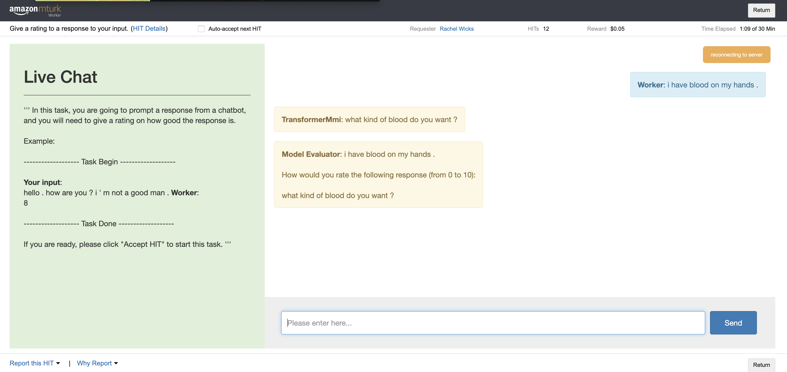
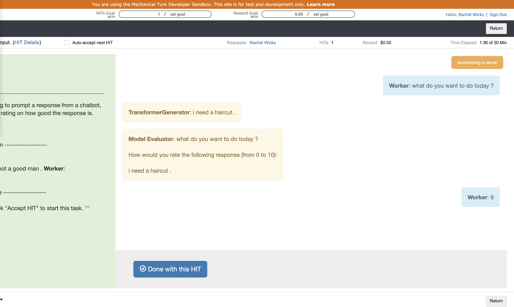
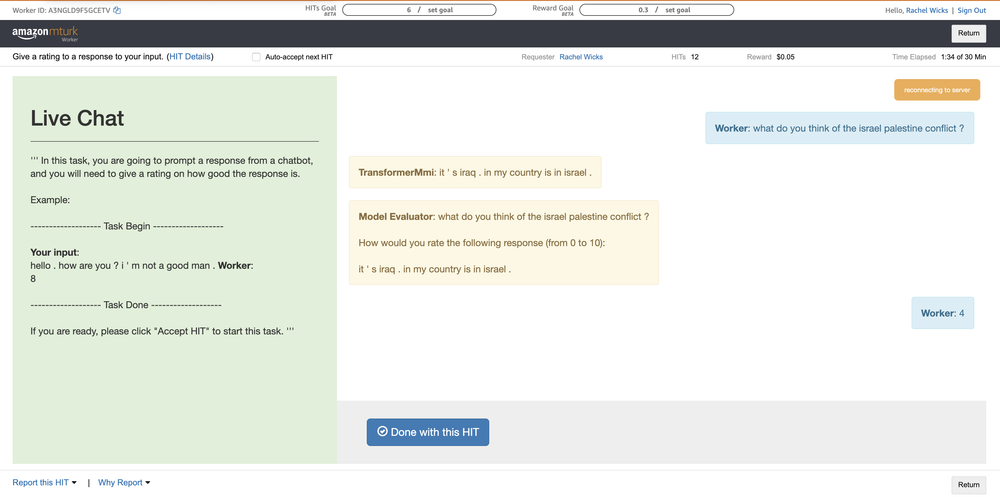
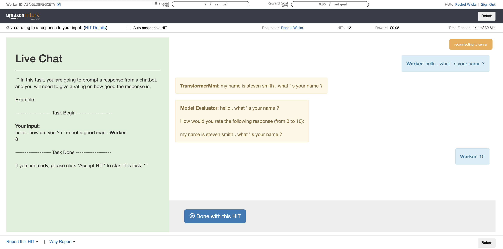
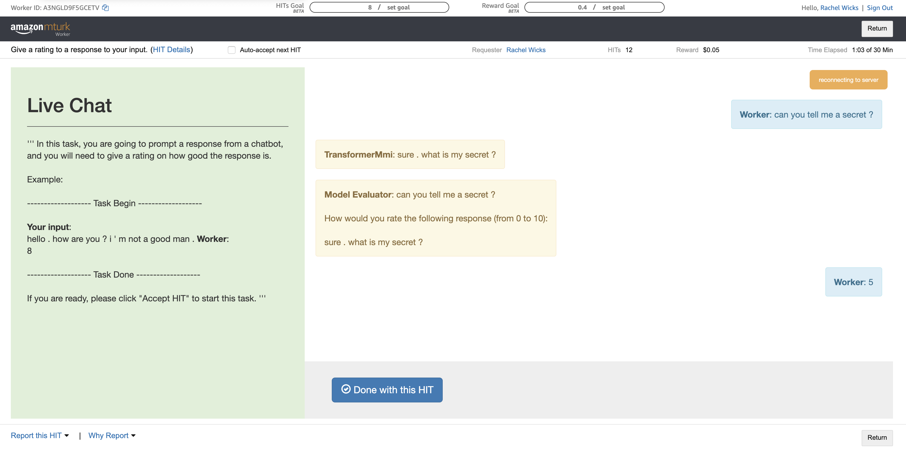
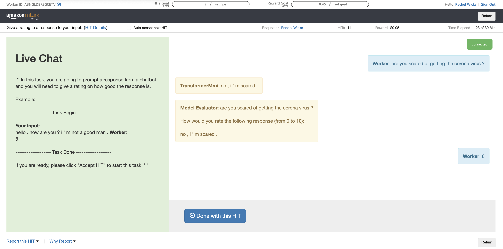
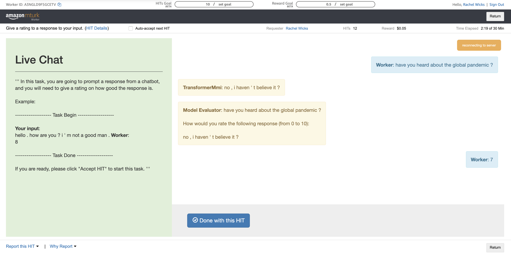
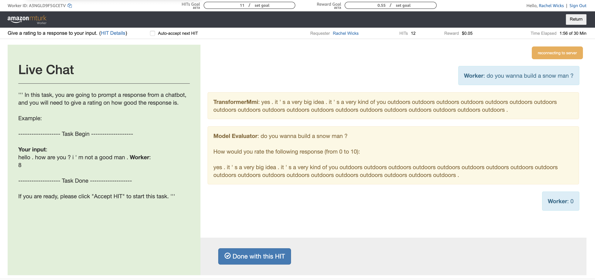
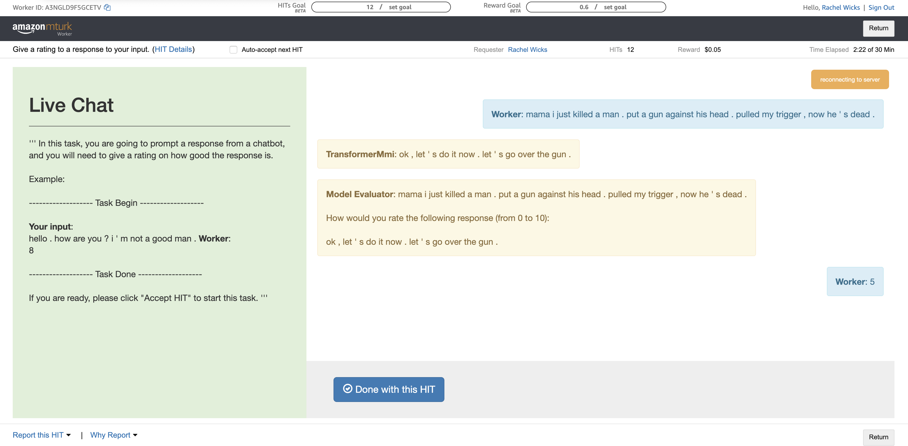

# HW4
Carlos Aguirre, Rachel Wicks, Nathaniel Weir

**Fork link** https://github.com/rewicks/ParlAI

**Link to models and screenshots** https://livejohnshopkins-my.sharepoint.com/:f:/g/personal/rwicks4_jh_edu/EmeBkYT-nYlOmRK--9afkkYB5jMfMZZ6RDVhICwspjrVUA?e=ACey6I

## Data filtering
We implement the entropy-based data filtering technique from [Csaky et al. 19](https://www.aclweb.org/anthology/P19-1567.pdf). We filter using their IDENTITY BOTH method, removing all examples with either a high source or target entropy. We select our entropy threshold to align with the fraction of data removed in the paper (about 15%). Our filtering script for applying to OpenSubtitles (from which we construct a new task, Filtered-OpenSubtitles) is [here](https://github.com/rewicks/ParlAI/blob/master/parlai/scripts/entropy_filter.py). We verified the filtering mechanism qualitatively (i.e. printed examples removed and checked some manually). 

## Method for training P(S|T)
We implement a FlippedTeacher agent which reads in the data in the same way as the P(T|S) model, but reverses the input and output. We admit that this provides a problem for the history, which is also in a reversed order. While this does not pose a problem for training, it creates a mismatched testing environment as the history is encoded in order.

## MMI-BIDI Objective
We implement beam search candidate reranking with a beam size of 15. This is implemented in a new agent, [TransformerMmiAgent](https://github.com/rewicks/ParlAI/blob/69e6e6868ddd9dcb17c31fdab2a39a87086c0cb6/parlai/agents/transformer/transformer.py#L388), an extension of the TransformerGeneratorAgent that stores an extra generation model (`self.backward_model`) and reranks the output candidates returned by its parent class's implementation of `self._generate()`. 

## Evaluation
We hooked up our model to the Mechanical Turk Sandbox. Instead of sampling from DailyDialog, or any other dataset, we allow the Turker to provide the input to the model. Below, we show screenshots of nine examples from the Sandbox. Additionally, we show the re-ranked beams with the original ranking, the log-liklihood of the forward and backwards models and the re-ranked score. To calculate this, we use the equation:

```BIDI=\lambda*P(T|S) + \lambda*P(S|T)```

We found that 0.5 for lambda provided reasonable balance between the two models.


```
    output                                         P(T|S)    P(S|T)    bidi_score
--  -------------------------------------------  --------  --------  ------------
 0  what kind of blood do you want ?             -2.36972  -17.954       -10.1619
 6  what kind of blood do you need your blood ?  -3.64016  -17.1321      -10.3861
 2  what kind of blood do you have in mind ?     -2.9105   -18.1907      -10.5506
10  what type of blood do you want ?             -4.19339  -17.5052      -10.8493
 3  what kind of blood are you scratching ?      -2.9649   -19.4833      -11.2241
 9  what kind of blood do you want to know ?     -4.17787  -19.3         -11.739
 7  your veins are swollen .                     -3.66672  -20.1026      -11.8846
11  what kind of blood do you want to work ?     -4.62718  -19.3644      -11.9958
 5  what kind of blood is it like ?              -3.627    -20.6871      -12.157
 8  what kind of blood is it ?                   -3.87363  -20.6378      -12.2557
 1  what do you mean ?                           -2.79299  -23.3423      -13.0676
 4  what do you think of going to do ?           -3.18451  -23.5597      -13.3721
```



```
    output                                      P(T|S)    P(S|T)    bidi_score
--  ----------------------------------------  --------  --------  ------------
 0  i need a haircut .                        -1.67265  -15.9636      -8.81813
 4  i want to make a change for a change .    -4.55133  -15.4651     -10.0082
 7  i want to make a change for my husband .  -5.17488  -15.0908     -10.1328
 2  i ' d like to check out some money .      -4.48891  -17.1055     -10.7972
 3  what ' s the matter ?                     -4.54861  -17.6818     -11.1152
 1  what ' s the difference ?                 -4.35998  -18.2966     -11.3283
 6  i ' d like to check out the apartment .   -4.77464  -17.8988     -11.3367
 5  i ' d like to check out these books .     -4.64713  -18.3529     -11.5
 8  i ' d like to check out some oil .        -5.31629  -17.8735     -11.5949
 9  i ' d like to check out some books .      -5.37595  -18.1349     -11.7554
```



```
    output                                                           P(T|S)    P(S|T)    bidi_score
--  -------------------------------------------------------------  --------  --------  ------------
 6  it ' s iraq . in my country is in israel .                     -5.41382  -38.3366      -21.8752
 2  it ' s iraq in the iraq centre .                               -4.66378  -39.9822      -22.323
 0  it ' s iraq .                                                  -3.18678  -41.9886      -22.5877
 7  it ' s iraq . the president of afghanistan is in the iraq .    -5.67612  -39.736       -22.706
 3  it ' s iraq . in my country is in the united .                 -4.86644  -40.5606      -22.7135
 4  it ' s iraq in the country .                                   -4.89805  -40.6789      -22.7885
 8  it ' s iraq . the president of afghanistan is in the united .  -5.75715  -39.8698      -22.8135
10  it ' s iraq . in my country is in the iraq .                   -6.01736  -40.0824      -23.0499
 5  it ' s iraq . in my country is in my country .                 -5.13829  -41.2226      -23.1805
 9  it ' s iraq . the president of afghanistan is in a military .  -5.91935  -40.6005      -23.2599
 1  it ' s a tank .                                                -3.80788  -51.013       -27.4104
```



```
    output                                             P(T|S)    P(S|T)    bidi_score
--  -----------------------------------------------  --------  --------  ------------
 1  my name is steven smith . what ' s your name ?   -4.73316  -18.1023      -11.4177
 3  my name is steven smith .                        -5.2796   -18.9951      -12.1373
10  my name is steven smith . what ' s yours ?       -5.95468  -18.5496      -12.2522
 6  my name is jane .                                -5.54618  -19.2749      -12.4105
 4  my name is peter smith .                         -5.30568  -19.872       -12.5888
 8  my name is steven smith . what ' s the matter ?  -5.71029  -19.5281      -12.6192
 9  my name is peter .                               -5.72448  -19.6669      -12.6957
 2  my name is peter harper .                        -5.21549  -20.3387      -12.7771
 7  my name is john smith .                          -5.70716  -20.2632      -12.9852
 5  my name is wang brown .                          -5.49232  -20.6447      -13.0685
 0  john smith .                                     -4.7329   -21.4865      -13.1097
```



```    output                              P(T|S)    P(S|T)    bidi_score
--  --------------------------------  --------  --------  ------------
 0  sure . what is my secret ?        -2.98752  -18.5847      -10.7861
 5  sure . what is the secret ?       -3.57223  -19.2466      -11.4094
 1  sure . what is it ?               -3.15841  -20.9833      -12.0708
 8  sure . i ' d love to .            -4.16326  -20.0517      -12.1075
 3  sure . what ?                     -3.40609  -21.0258      -12.2159
 2  sure .                            -3.28311  -21.2284      -12.2557
 6  sure . there is anything wrong ?  -3.93081  -20.7149      -12.3229
 4  of course .                       -3.40998  -21.291       -12.3505
 9  sure . i ' d love it .            -4.93635  -19.7759      -12.3561
 7  sure . where shall i go ?         -4.00274  -20.7659      -12.3843
```



```
    output                                                                       P(T|S)    P(S|T)    bidi_score
--  -------------------------------------------------------------------------  --------  --------  ------------
 1  no , i ' m scared .                                                        -4.02845  -40.0044      -22.0164
 3  yes , i think so . i ' m just scared .                                     -4.68727  -40.8806      -22.7839
 0  yes , i am .                                                               -3.19565  -43.5845      -23.3901
 6  yes , i think so . i don ' t think i can speed it up .                     -5.8787   -41.0142      -23.4465
 9  yes , i think so . i don ' t think i ' m scared and scared .               -6.61951  -41.1737      -23.8966
 2  yes , i think so .                                                         -4.56916  -43.2287      -23.8989
 5  yes , i think so . i don ' t trust it .                                    -5.49868  -42.9094      -24.204
 7  yes , i think so . i don ' t feel like puking like puking like vomiting .  -5.94408  -42.5076      -24.2259
 4  really ?                                                                   -5.17397  -43.3671      -24.2705
 8  yes , i think so . i don ' t think i ' ve ever seen before .               -6.56923  -43.0115      -24.7904
```



```
    output                                                                                P(T|S)    P(S|T)    bidi_score
--  ----------------------------------------------------------------------------------  --------  --------  ------------
 0  no , i haven ' t believe it ?                                                       -3.44111  -35.5758      -19.5084
 6  no , i haven ' t believe it ? it ' s just that any other news news .                -5.80312  -35.021       -20.4121
 8  no , i haven ' t believe it ? it ' s just that any other news news news .           -5.97332  -34.967       -20.4702
 7  no , i haven ' t believe it ? it ' s just that any other news .                     -5.93108  -35.2231      -20.5771
11  no , i haven ' t believe it ? it ' s just that any other news news news news .      -6.37421  -34.9197      -20.647
 9  no , i haven ' t believe i heard yet . i ' ve heard it ' s not in one any other .   -6.21714  -35.4475      -20.8323
 2  no , i haven ' t believe i ' ve taken it yet .                                      -4.84293  -36.8953      -20.8691
13  no , i haven ' t believe i ' ve taken it yet . i ' ve heard it ' s not yet .        -6.71138  -35.1288      -20.9201
10  no , i haven ' t believe it ? it ' s just beginning to tell him that the sources .  -6.29923  -35.8558      -21.0775
 5  no , i haven ' t believe it ? it ' s just not just started .                        -5.34586  -37.1367      -21.2413
 4  no , i haven ' t believe i ' ve seen it for me .                                    -5.23298  -37.3484      -21.2907
 1  no , i haven ' t believe i ' ve done anything .                                     -4.83761  -38.3808      -21.6092
 3  no , i don ' t believe i ' ve done anything .                                       -4.95612  -38.9335      -21.9448
12  no , i haven ' t believe it ? it ' s just not just started . it ' s not like it .   -6.53964  -37.7402      -22.1399
```



```
    output                                                                                                                                                                                                                                            P(T|S)    P(S|T)    bidi_score
--  ----------------------------------------------------------------------------------------------------------------------------------------------------------------------------------------------------------------------------------------------  --------  --------  ------------
 4  yes . it ' s a very big idea . it ' s a very kind of you outdoors outdoors outdoors outdoors outdoors outdoors outdoors outdoors outdoors outdoors outdoors outdoors outdoors outdoors outdoors outdoors outdoors outdoors outdoors .           -5.19987  -32.5431      -18.8715
 5  yes . it ' s a very big idea . it ' s a very kind of you outdoors outdoors outdoors outdoors outdoors outdoors outdoors outdoors outdoors outdoors outdoors outdoors outdoors outdoors outdoors outdoors outdoors outdoors .                    -5.24875  -32.5563      -18.9025
 8  yes . it ' s a very big idea . it ' s a very kind of you outdoors outdoors outdoors outdoors outdoors outdoors outdoors outdoors outdoors outdoors outdoors outdoors outdoors outdoors outdoors outdoors outdoors outdoors outdoors outdoors .  -5.26859  -32.5379      -18.9032
 9  yes . it ' s a very big idea . it ' s a very kind of you outdoors outdoors outdoors outdoors outdoors outdoors outdoors outdoors outdoors outdoors outdoors outdoors outdoors outdoors outdoors outdoors outdoors .                             -5.33296  -32.5773      -18.9551
10  yes . it ' s a very big idea . it ' s a very kind of you outdoors outdoors outdoors outdoors outdoors outdoors outdoors outdoors outdoors outdoors outdoors outdoors outdoors outdoors outdoors outdoors .                                      -5.40558  -32.5991      -19.0023
11  yes . it ' s a very big idea . it ' s a very kind of you outdoors outdoors outdoors outdoors outdoors outdoors outdoors outdoors outdoors outdoors outdoors outdoors outdoors outdoors outdoors .                                               -5.49829  -32.6386      -19.0685
15  yes . it ' s a very big idea . it ' s a very kind of you outdoors outdoors outdoors outdoors outdoors outdoors outdoors outdoors outdoors outdoors outdoors outdoors outdoors outdoors .                                                        -5.66007  -32.701       -19.1806
17  yes . it ' s a very big idea . it ' s a very kind of you outdoors outdoors outdoors outdoors outdoors outdoors outdoors outdoors outdoors outdoors outdoors outdoors outdoors .                                                                 -5.9137   -32.7393      -19.3265
22  yes . it ' s a very big idea . it ' s a very kind of you outdoors outdoors outdoors outdoors outdoors outdoors outdoors outdoors outdoors outdoors outdoors outdoors .                                                                          -6.24401  -32.7746      -19.5093
13  yes , ma ' am . it depends on what you paint ?                                                                                                                                                                                                  -5.58332  -34.2674      -19.9254
 0  yes , ma ' am .                                                                                                                                                                                                                                 -4.23744  -35.9602      -20.0988
 2  yes . it ' s a very good shot .                                                                                                                                                                                                                 -5.05603  -35.9445      -20.5003
 3  yes . it ' s very beautiful .                                                                                                                                                                                                                   -5.17334  -35.831       -20.5022
19  yes , ma ' am . it ' s a very kind of you paint .                                                                                                                                                                                               -6.07411  -35.0477      -20.5609
12  yes , ma ' am . it depends on what you do ?                                                                                                                                                                                                     -5.55602  -35.8825      -20.7192
14  yes , ma ' am . it depends on what you do .                                                                                                                                                                                                     -5.59236  -36.0089      -20.8006
25  yes . it ' s a very natural . it ' s a very kind of warm warm warm warm warm warm warm warm warm warm warm up this day .                                                                                                                        -6.48269  -35.3001      -20.8914
24  yes . it ' s a very natural . it ' s a very kind of warm warm warm warm warm warm warm warm warm warm warm warm up this day .                                                                                                                   -6.47866  -35.3076      -20.8931
29  yes . it ' s a very big idea . it ' s a very kind of warm warm warm warm warm warm warm air .                                                                                                                                                   -6.6328   -35.2036      -20.9182
30  yes . it ' s a very big idea . it ' s a very kind of warm warm warm warm warm warm air .                                                                                                                                                        -6.63343  -35.2248      -20.9291
31  yes . it ' s a very big idea . it ' s a very kind of warm warm warm warm warm warm warm warm air .                                                                                                                                              -6.68956  -35.1879      -20.9387
32  yes . it ' s a very big idea . it ' s a very kind of warm warm warm warm warm air .                                                                                                                                                             -6.7342   -35.2659      -21
34  yes . it ' s a very natural . it ' s a very kind of warm warm warm warm warm warm warm warm air .                                                                                                                                               -6.79316  -35.2147      -21.0039
 1  yes . it ' s very kind of you .                                                                                                                                                                                                                 -4.99823  -37.0431      -21.0207
35  yes . it ' s a very big idea . it ' s a very kind of warm warm warm warm air .                                                                                                                                                                  -6.84195  -35.3214      -21.0817
16  yes , ma ' am . it ' s a very kind of you .                                                                                                                                                                                                     -5.75165  -36.5284      -21.14
18  yes . it ' s a very natural . it ' s a pretty big figure .                                                                                                                                                                                      -6.06448  -36.2327      -21.1486
 6  yes . it ' s a very good idea .                                                                                                                                                                                                                 -5.25844  -37.0842      -21.1713
 7  yes . it ' s a very big idea .                                                                                                                                                                                                                  -5.25927  -37.1346      -21.1969
36  yes . it ' s a very big idea . it ' s a very kind of warm warm warm air .                                                                                                                                                                       -7.00842  -35.3914      -21.1999
28  yes . it ' s a very natural . it ' s a very kind of warm warm warm warm warm warm warm warm warm warm warm warm warm up chicken .                                                                                                               -6.56322  -36.0001      -21.2817
26  yes . it ' s a very natural . it ' s a very kind of warm warm warm warm warm warm warm warm warm warm warm warm up chicken .                                                                                                                    -6.50736  -36.0797      -21.2935
27  yes . it ' s a very natural . it ' s a very kind of warm warm warm warm warm warm warm warm warm warm warm up chicken .                                                                                                                         -6.53893  -36.1605      -21.3497
33  yes . it ' s a very natural . it ' s a very kind of warm warm warm warm warm warm warm warm bath .                                                                                                                                              -6.76873  -36.204       -21.4864
21  yes . it ' s a very natural . it ' s a very kind of you .                                                                                                                                                                                       -6.21032  -37.0983      -21.6543
20  yes . it ' s a very big idea . it ' s a very kind of you .                                                                                                                                                                                      -6.09558  -37.5492      -21.8224
23  yes . it ' s a very big idea . it ' s a very big one .                                                                                                                                                                                          -6.40939  -37.4118      -21.9106
```



```
    output                                                 P(T|S)    P(S|T)    bidi_score
--  ---------------------------------------------------  --------  --------  ------------
 8  ok , let ' s do it now . let ' s go over the gun .   -7.71647  -110.311      -59.0139
 0  oh , yeah ?                                          -4.95413  -115.518      -60.2361
 1  ok , let ' s go .                                    -5.96075  -114.813      -60.3871
 4  ok , let ' s go over the baby .                      -6.81432  -114.216      -60.5153
 3  ok , let ' s do it now .                             -6.72991  -114.336      -60.5331
 7  ok , let ' s do it now . let ' s go over the face .  -7.54018  -113.533      -60.5364
 6  ok , let ' s do it now . let ' s go over the baby .  -7.50996  -113.627      -60.5684
 5  ok , let ' s do it now . let ' s go .                -7.23143  -114.082      -60.6568
 2  ok , let ' s go . i ' m not laid off now .           -6.63332  -114.939      -60.786
 9  ok , let ' s go . i ' m not laid off now . i ' d .   -8.13839  -115.206      -61.6722
```

## Future Work and Conclusion
* Due to the mismatch between the history in the training and testing setting for the backwards model, we would improve this by either clearing the history after each prediction or altering the training setting so that the inputs are re-ordered when encoded into the context/history.
* We still have an issue with repetition (as displayed in screenshot 8).
* The outputs seem to favor repeating words that were in the input. This is likely due to the backwards model putting a preference towards those outputs.
